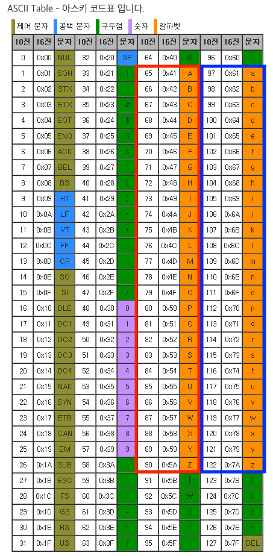

# 자바스크립트로 아스키코드 변환하기

## ASCII 코드

- ASCII는 `American standard code for information interchange cod`의 약자로서 컴퓨터는 문자를 숫자로 인식하는데 있어서 사용되는 인코딩 방식 중 하나이다. 어떤 문자와 어떤 숫자가 매칭되는지는 아래의 이미지를 통해서 알 수 있다.

- 일반적으로 알파벳 대문자와 소문자가 어떤 숫자와 매칭되는지 정도는 알고 있는 것을 강추한다. `A~Z`는 `65~90`(빨간박스), `a~z`는 `97~122`(파란박스)이다. ⭐️

<br />



<br />

## 변환 메소드

자바의 경우는 타입이 존재한다. 그래서 문자타입(char)을 int형으로 (형)변환하면 그에 맞는 아스키코드로 변환된다. 반대로 마찬가지이다.

```java
// char -> int
char ch = sc.nextLine().charAt(0); //문자열 입력 후 첫번째 글자
int iCh = int(c);

//int -> char
int num = sc.nextInt(); // 숫자 입력
char cNum = char(num);
```

<br />

이에 반해 자바스크립트는 타입이 존재하지 않기 때문에 문자에 맞는 아스키코드를 구하고 싶다면 해당 메소드를 사용하여 변환시킬 수 있다.

- From char To int : `charCodeAt()`

  > 주어진 문자열.charCodeAt(`알기를 원하는` 해당 문자열의 `인덱스`), 인자로 아무값도 들어가지 않는다면 `기본값 0`을 갖는다.

- From int To char : `fromCharCode()`

  > static method로서 String.fromCharCode(숫자) : 인자로 들어가는 숫자는 여러 개를 받을 수 있다.

<br />

```javascript
// char -> int
const string = 'Hello World';

const number1 = string.charCodeAt(4);
// 인덱스가 4인 문자(o)를 아스키 코드로 변환 : 111
const number2 = string.charCodeAt(6);
// 인덱스가 6인 문자(W)를 아스키 코드로 변환 : 87

// int -> char
const char1 = String.fromCharCode(80);
// P
const char2 = String.fromCharCode(74, 97, 118, 97, 83, 99, 114, 105, 112, 116);
// JavaScript
```
