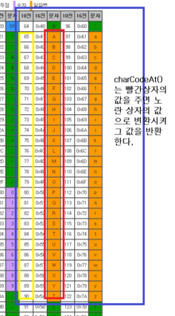

# Caesar Cipher

`카이사르 암호`:

실제로 카이사르 황제가 이 방법으로 편지 내용을 암호화하여 사용했다고 하여 이름이 카이사르 암호이다. 카이사르 암호는 내용의 각 문자를 `일정거리의 숫자`만큼 밀어내서 다른 글자로 치환하여 완전 새로운 내용을 만드는 방식을 말한다.

# WIL(What I Learned this problem)

> 이 문제를 통해서 알게 된 사실들에 대해 간단하게 정리한다.

## Solution1 & Solution2

- 직접 `알파벳의 포멧`을 만들어서 그 인덱스를 사용해서 치환하여 새로운 문자열을 만든다.
- 솔루션1과 솔루션2는 사실상 같은 방법이다. 하지만 솔루션2가 솔루션1보다 더 일반화되어있다.
- 주어진 `count가 양수일 때와 음수일 때`를 `DRY`하게 잘 구분하였다. 딱 필요한 부분에서만을 조건으로 분기해주었다. 반면, 솔루션1의 경우는 이 조건 하나만으로 전체가 반복되고 있다. 사실 이 부분이 두가지 풀이의 가장 큰 차이점이라고 생각한다.
- 솔루션1에서 반복이 일어난 이유는 count 조건 때문이기도 하지만, `대문자와 소문자를 구분하는 방법`에 있다. 풀이의 시작이 대문자와 소문자를 구분하면서 시작하기때문에 조건이 나열될 수 밖에 없었던 것 같다. <u>조건을 명시하기 전에 조건의 크기를 생각해야 할 것 같고, 그 조건보다도 우선 되는 것은 공통된 부분을 우선으로 접근하는 것이라는 생각이 든다.</u>

**✔ `공통된 부분`을 잘 `추상화`하여 `다른 부분만`을 `조건`으로 나눠줄 수 있는 접근 방법이 필요했다.**

**✔ 생각의 흐름 : `공통된 부분 > 큰 조건 > 작은 조건`**

<br/>

## Solution3

> `String.prototype.charCodeAt()` 를 사용할 수 있다. 이 메소드는 인자로 넘겨받은 해당 문자열의 index를 UTF-16에 해당하는 숫자로 변환시켜준다. 쉽게 말해서 주어진 문자를 아스키코드(숫자)로 변환시켜 그 값을 반환한다.

> `String.fromCharCode(num1 [, num2, num3 ...])`는 위 메소드와 정확히 반대 기능을 갖는다. 코드를 문자로 변환시켜준다. 여러 개의 숫자를 넣으면 연결된 문자열을 반환한다.

```javascript
const str = 'jjanmo';

const changedCode1 = str.charCodeAt(5); //index 5 : 알파벳 o
const changedCode2 = str.charCodeAt(2); //index 2 : 알파벳 a
const changedCode3 = str.charCodeAt(0); //index 3 : 알파벳 j

console.log(changedCode1, changedCode2, changedCode3);
//순서대로 111(알파벳 o는 숫자 111에 해당), 97 106

String.fromCharCode(changedCode1, changedCode2, changedCode3);
//순서대로 문자열 "oaj" 를 반환
```



> [참고](https://shaeod.tistory.com/228)

> 위 두 메소드를 이용해서 코드표 안에서 문자를 밀고 당기고 하여서 변환시켜서 새로운 문자열을 만들면 된다.

<br/>

- 개인적인 생각

  > 처음에 위 방법으로 해결하였다. 하지만 풀다보면 뭔가 메소드 의존적이라는 생각이 든다. 즉, 위 메소드를 알고 있고 아스키코드(UTF-16)에 대해서 알고 있어야 한다는 전제 조건이 필요하기 때문에 좋은 해결방안이라고 생각하지 않았다. 그래서 첫번째 혹은 두번째 풀이가 <u>더 현실적인 풀이</u>라는 생각을 한다.

  > > 물론 `아스키코드, 유니코드, UTF-16...` 이러한 숫자에 대한 개념을 좀 더 명확하게 갖고 있어야만 하는 것은 개발자로서의 당연한 상식이지않을까...(나 역시 그러지못한듯하지만,,말만이라도 😭)
