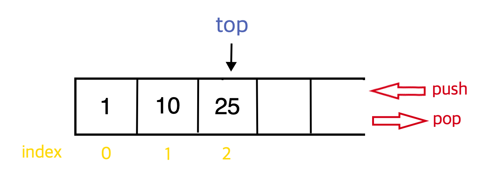

# Stack

> 스택은 자바스크립트에서 중요한 자료 구조이다. `Call Stack(콜스택)`이라고 들어봤는가? 콜스택은 현재 실행 중인 `실행 문맥(Execution Context)`이 쌓이는 위치를 말한다.(쉽게 현재 실행 중인 함수들이 쌓이는 것이라고 생각해도 무방하다.) 콜 스택은 스택이 갖는 특징을 정확하게 동일하게 갖기 때문에 자바스크립트를 이해하는데 스택은 중요하다고 할 수 있다. 스택의 특징에 대해서 알아보자.

## Features

-   array like structure

-   자료가 출입이 가능한 입구가 한군데이다. 한 방향으로만 자료가 들어오고 나갈 수 있다. 이로 인해 아래와 같은 특징이 나타난다.

-   ⭐️ `LIFO` Last In First Out : 마지막에 들어간 자료가 가장 먼저 나온다는 의미

    > 스택은 이 특징이 가장 유명하고 가장 중요하다.

-   자료가 쌓일 때, 가장 맨 위의 위치를 `top`이라고 한다. 자료의 출입은 모두 `top`과 관련있다. 자료가 삽입될 때는 `top`위에 쌓이게 되고, 자료가 삭제될 때도 `top`에 해당하는 자료가 삭제된다.

-   스택에 자료가 모두 쌓여서 더이상 쌓일수 없을 때, 이를 `stack overflow`라고 한다. 이와 반대로 스택에서 값을 추출하려고 할 때, 값이 없는 경우는 `stack underflow`라고 한다.

-   프로퍼티 및 메소드
    -   top : 가장 마지막에 쌓인 자료의 위치(인덱스)
    -   size : 스택의 크기
    -   push(item) : 해당 자료는 스택의 top에 삽입
    -   pop() : 해당 재료를 스택의 top에서 제거
    -   peek() : 스택의 가장 위에 있는 항목을 반환
    -   isEmpty() : 스택이 비어있는지의 여부를 boolean 값으로 반환
    -   search(target) : 스택에 타겟이 존재하면 해당 인덱스를 반환하고 없으면 -1을 반환

## Example

스택을 실제로 어디서 활용할 수 있을까? 이 부분에 대한 고민이 없었기 때문에 구글링을 해보았다. 스택은 우리와 아주 가까운 곳에 있었다. 바로 웹/앱에 존재하고 항상 사용하는 `뒤로가기`의 구현이였다. 생각해보면 그렇다. 뒤로 가기를 누르면 가장 최신에 본 페이지로 돌아간다. 즉 내가 본 페이지의 주소들이 스택이라는 히스토리 자료 구조에 담기고 뒤로 가기를 누르면 스택의 가장 위에 쌓여있는 주소부터 나에게 돌려준다. 이러한 방식은 정확히 스택의 개념과 같다.😈

> 이러한 것을 `history back`이라고 하는데, 뒤로가기 버튼은 생각보다 간단하지 않다. 스택에 대한 내용을 담고 있지만, 뒤로가기 기능을 어떻게 구현할 것인가의 기획 의도에 따라서 앞에서 말한 ``history back` 이냐 혹은 `hierarchy back` 이냐를 구분한다. 자세한 내용은 [여기](https://brunch.co.kr/@uxdesingercho/1)를 참고하면 스택과 함께 좀 더 자세히 이해할 수 있을 것 이다.

# Ref

-   [Implement a Stack in JavaScript
    ](https://initjs.org/data-structure-stack-in-javascript-714f45dbf889)
