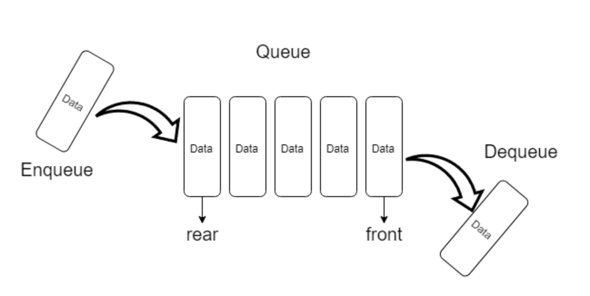
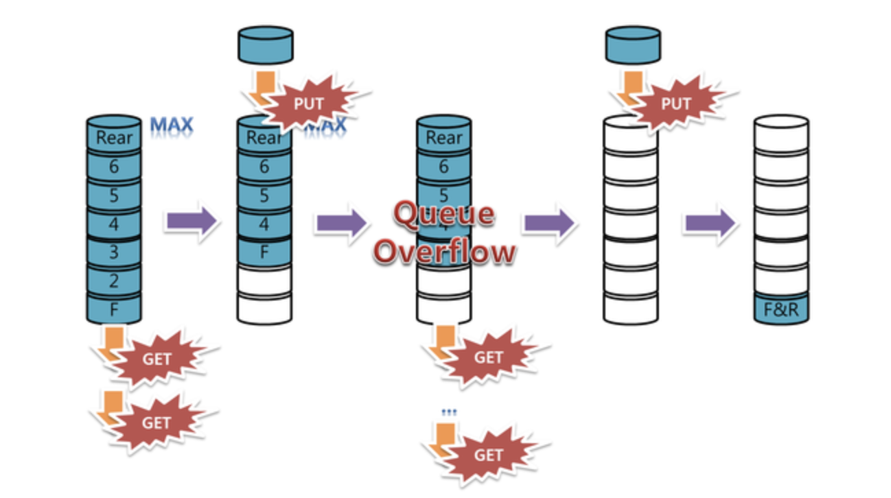
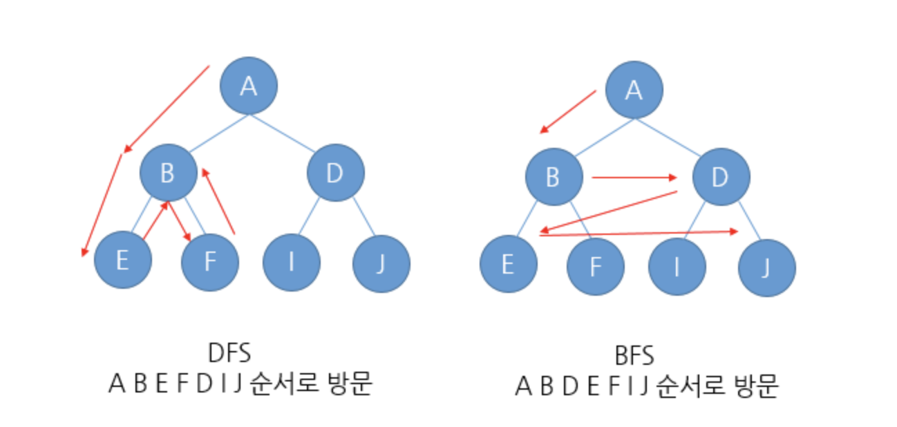

# Queue(Linear Queue)

## Features

-   array like structure

-   자료가 들어오는 입구와 자료가 나가는 출구가 존재한다. 즉 자료의 출입을 담당하는 문이 2개이다. 이 때문에 자료가 단방향으로 움직이게 된다.

-   문이 2개 이기 때문에 자료의 출입이 각각 **독립적**이다.

-   ⭐️ `FIFO` First In First Out : 먼저 들어간 자료가 먼저 나온다는 의미

-   큐는 첫번째 자료의 위치를 나타내는 `front`와 마지막 자료의 위치를 나타내는 `back(rear)`의 이동에 의해서 작동한다.

    > 이 부분은 `linear queue` 의 단점을 알게되면서 좀 더 명확하게 이해 할 수 있었다.

     

 

-   프로퍼티및 메소드

    -   front : 큐의 첫번째 자료의 위치
    -   back(rear) : 큐의 마지막 자료의 위치
    -   size : 큐의 크기
    -   add(item) : `enqueue` 라고 부른다. 큐의 마지막 위치에 자료를 추가한다.
    -   remove() : `dequeue`라고 부른다. 큐의 첫번째 자료를 제거한다.(front위치에서 자료를 제거)
    -   peek() :큐의 가장 위에 있는 자료를 반환한다.(front위치의 자료의 값을 반환()
    -   isEmpty() : 큐가 비어있는지 여부를 확인한다.

-   큐에 자료가 모두 쌓여서 더 이상 쌓일 수 없을 때, 이를 `queue overflow`라고 한다. 이와 반대로 큐에서 값을 추출하려고 할 때, 값이 없는 경우는 `queue underflow`라고 한다.

-   linear queue의 단점

    

    > 위의 다이어그램처럼 큐가 한 번 가득차게 된 후에 자료를 제거하게 되면 자료는 앞에서부터(front위치)빠져나가기 때문에 빈 공간이 생기게 된다. 여기서 중요한 점은 <u>자료가 빠져나가면서 front의 위치가 변하게 된다.</u>(**큐 안의 자료가 앞으로 옮겨지는 것이 아니다**)

    > 자료가 빠져나갔음에도 마지막 위치(back위치)는 변하지 않았기 때문에 큐는 계속 가득찬 상태로 인지된다. <u>즉 공간의 낭비가 발생하게 된 것!</u>

    > 이를 해결하기 위해서 빈 공간이 생길 때마다 큐를 앞으로 옮겨주는 것은 비효율적이다. 그래서 나타난 것이 `원형큐(Circular Queue)`이다.

## Example

-   데이터의 입력 순서대로 처리를 해야하는 경우에 큐를 사용할 수 있다.

    > 은행에서 **고객의 대기번호**

    > `BFS(Breath First Search, 너비우선탐) 알고리즘`을 구현할 때 사용한다. 이 부분은 알고리즘파트에서 자세히 알아보도록하자.

 

### 궁금한 사람 🧐 을 위한 공간 💡

`그래프` 라는 자료구조를 탐색하는 알고리즘으로 크게 위에서 말한 BFS(Breath First Search)와 DFS(Dept First Search, 깊이 우선 탐색)이 있다.

-   BFS : `노드의 형제들`을 우선 탐색하는 방법
-   DFS : `노드의 자식들`을 우선 탐색하는 방법

> [참고](https://m.blog.naver.com/PostView.nhn?blogId=591923&logNo=220913738926&proxyReferer=https:%2F%2Fwww.google.com%2F)

 

# Ref

-   [큐(Queue)란](https://gmlwjd9405.github.io/2018/08/02/data-structure-queue.html)

-   [자료구조 - 큐(Queue)](https://m.blog.naver.com/PostView.nhn?blogId=ljsk139&logNo=30165800034&proxyReferer=https:%2F%2Fwww.google.com%2F)
