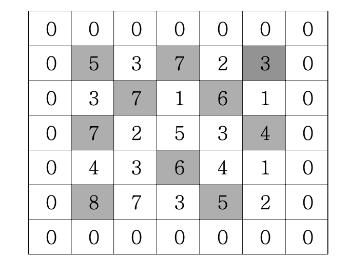
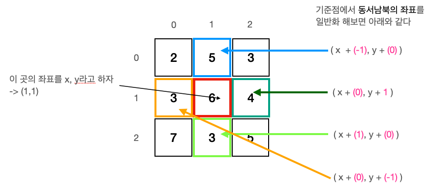

# What I learned this problem

> 해당 문제(섹션 2-7)는 격자판에 봉우리(이미지에서 검은 칸)는 세는 문제였다. 격자칸에서 4방향에 있는 수와 모두 비교했을 때, 모두 크다면 그 칸은 봉우리라고 한다.



<br />

## 생각

문제를 풀 때, 2가지의 난관이 있었다. 먼저 어떻게 4가지 방향의 수와 비교할 것인가에 대한 것과 가장 자리의 수는 어떻게 비교할 것인지에 대한 것이였다. 사실 위 문제를 고민 고민해봤지만 마땅한 방법을 떠오르지 못해 약간의 힌트를 통해서 문제를 풀어내었다.🤪 아마도 이 힌트를 들으면 반복문을 돌릴줄만 안다면 누구든 풀수있을거라 생각한다. 하지만 **이걸** 생각하지 못한 이유 중에 가장 큰 것은 바로 이중반복문 안에 다시 반복문이 들어가기 때문이 아닐까 싶다.

`일반적으로 이중반복문은 될수 있으면 사용하지 말자, 더 좋은 방법이 있을거야 라는 인식을 갖고 있는데, 심지어 그 안에 반복문을 또 돌린다고??`

위와 같은 편견은 문제 풀이에서는 그렇게 좋은 생각은 아닌 것 같다. 어떻게든 문제를 풀어내는 것을 우선 순위로 삼는 것이 맞다는 생각을 하게 되었다.

다시 문제로 돌아와서 힌트는 바로 <u>4방향을 상수 배열로 만들어 내는 것</u>이다. 즉 각 좌표에 4방향의 좌표를 구하는데 필요한 배열을 일반화하여 나타낼 수 있다. 이 말을 그림으로 도식화해보면 아래와 같다.



여기서 오른쪽에 x좌표와 y좌표에 **핑크색 숫자**가 4방향의 좌표를 구하기 위해서 항상 일정하게 더해지는 숫자이다. 이를 코드로 표현하면 아래와 같다.

```js
const direction = [
  [-1, 0],
  [0, 1],
  [1, 0],
  [0, -1],
];
```

나 같은 경우엔 북쪽부터 오른쪽으로 돌렸지만, 어떻게 표현하든 상관없다. 중요한 것은 상수로 표현할 수 있다는 것이다. 이렇게 하면 이중반복문을 통해서 각 좌표에 접근할 수 있고 각 좌표에서 이 direction을 이용해서 4개의 좌표를 비교하여 봉우리를 판단할 수 있다. 여기서 이중반복문 안에 반복문을 다시 돌린다고 했지만, 어떻게 보면 항상 4개만을 비교하는 상수라고 생각할 수 있다. 컴퓨터 연산에서 4개의 비교는 속도에 거의 영향이 없다고 볼 수 있기에 시간복잡도를 고려할 필요는 없다는 생각을 하게 되었다.

이렇게 첫번째 난관이 풀렸다. 그럼 이제 두번째 난관인 가장자리는 어떻게 비교할 것인가였다. 자바스크립트에서는 배열에 인덱스가 없는 요소에 접근하려고 하면 `undefined`를 출력한다. 그렇기 때문에 이를 이용하면 되지않을까 생각했다.

```js
const array = [1, 2, 3, 4];
array[10]; // undefined
array[-5]; // undefined
```

하지만 여기서 문제는 이중반복문이라는 것이다. 예를 들어서 `array[-1][2]`라고 하면 먼저 array[-1]에 접근한 후 [2] 인덱스로 접근한다. 그런데 array[-1]이 이미 undefined 이기 때문에 접근하기도 전에 에러가 뜨게 되는 것이였다.

`Cannot read property '0' of undefined` 😱

이를 해결한 방법은 배열의 값을 접근하기 전에 인덱스값을 미리 계산해서 그 값이 0보다 작거나 배열의 길이와 같거나 크게되는 경우를 제외 시켜주었다.

<br />

어떻게 보면 단순 반복문을 돌리는 문제라고 생각할지 모르겠지만, 여기서도 문제를 접근하는 방법에 대한 포인트들에 대해서 생각하고 배울 수 있었다. 또 상수화한 배열이라는 다른 생각을 갖게된 좋은 문제라고 생각한다.
