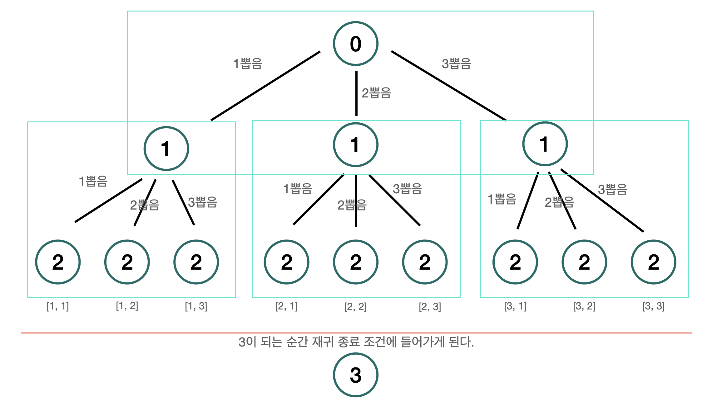

# 중복 순열을 어떻게 구현할까?

> 중복 순열을 도식화해보자.

> 중복 순열이란 `n∏r` 은 n개의 서로 다른 원소 중에서 중복을 허용하여 r개를 뽑아서 한 줄로 나열하는 경우의 수 [[위키](https://ko.wikipedia.org/wiki/%EC%A4%91%EB%B3%B5%EC%88%9C%EC%97%B4)]

## 문제(Section8-8)

1부터 N까지 번호가 적힌 구슬이 있습니다. 이 중 중복을 허락하여 M번을 뽑아 일렬로 나열 하는 방법을 모두 출력합니다.

```json
INPUT (N, M)
(3, 2)

OUTPUT
1 2
1 3
2 1
2 2
2 3
3 1
3 2
3 3
9   //총 개수
```

> 위의 예제인 `3∏2` 를 구해보면서 일반화를 시켜보자.

- for문 이용

  먼저 쉽게 생각하여 `for문을 통해서 구할 수 있다` 라고 착각(?) 할 수 있다. 나 역시 for문으로 먼저 구해보았다.

  ```js
  const result = [];
  let count = 0;
  for (let i = 0; i < 3; i++) {
    result[0] = i + 1;
    for (let j = 0; j < 3; j++) {
      result[1] = j + 1;
      console.log(result.join(' '));
      count++;
    }
  }
  console.log(count);
  ```

  위의 예제와 같은 출력값을 얻을 수 있다. 그런데 말입니다 🤔 위의 풀이에선 M이 2였기 때문에 두 번만 뽑으면 되기 때문에 이중for문이였지만, M이라는 변수를 일반화 시킬려면 for문이 M번 돌면 된다. 음... M이 10이면 10중 for문이 된다. 시간복잡도 n^m 이다.

- 재귀 이용

  중복순열 문제는 기존의 이진 트리에서의 재귀를 이용하는 방법을 약간 업그레이드 시킨 문제라고 볼 수 있다. 아래 이미지를 보면 왜 이 문제가 트리 문제로 귀결되는지 이해할 수 있으며, 재귀를 이용할 수 있다라는 사실을 인지하게 될 것이다.

  

  > 녹색 사각형이 반복됨을 알 수 있다. 뽑는 경우의 수는 for문을 통해서 구현하고 몇 번 뽑을 것인가(M에 해당)를 일반화하는 것을 재귀를 통해서 구현할 수 있다. 결국, M중 for문을 재귀를 이용해서 구현한 것이라고 생각하면 이해가 쉬울수도...(사실 이 자체로 이해하는 것을 추천 😅)
